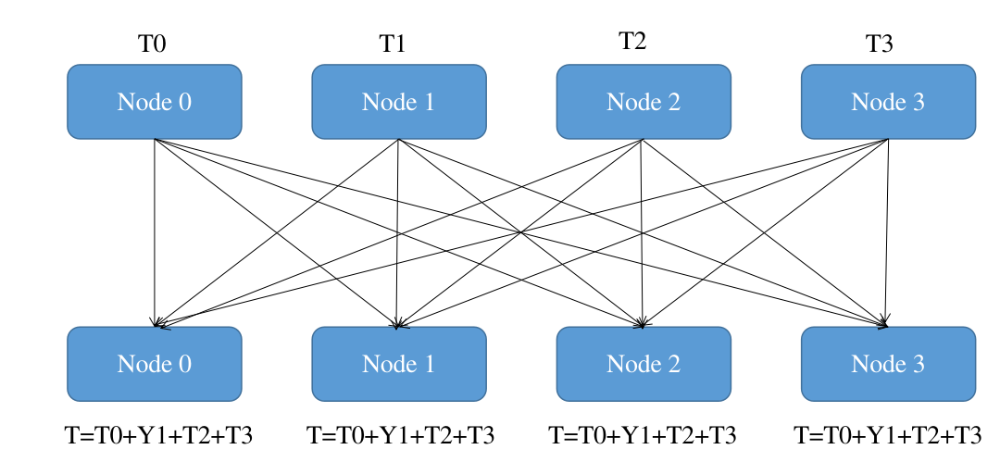

# FAT_Distributed

## 搭建说明  
本项目所要做的是引入了对抗训练的联邦学习模型的多计算节点实现，联邦学习所采用的中心聚合方式通常为Federated Average。一般而说，这样的中心聚合方式在分布式计算中，通常称之为all-reduce。如图所示为all-reduce的原理。  
  

任务描述：现有2个计算节点，每个计算节点有一张Nvidia TiTan显卡，每次的Batch有$2 \times batcsize$的数据，现在希望能够将模型复制到这两张卡，每张卡负责计算batchsize个数据的梯度，然后将这两张卡的梯度平均起来，接着再把梯度更新到所有模型上。
### 1.数据集  
采用Mnist、FMnist和Cifar10作为验证数据集，直接从torchvision中调用即可，本文在此打开了下载开关。  
```
def load_data(dataset):
    """load the datasets"""
    data_dir = "Dataset"
    if dataset == "mnist":
        train_dataset = datasets.MNIST(data_dir,train=True,transform=transforms.Compose([transforms.ToTensor()]),download=True)  # load the trainset for mnist
        test_dataset = datasets.MNIST(data_dir,train=False,transform=transforms.Compose([transforms.ToTensor()]),download=True)  # load the testset for mnist
        X_train, y_train = train_dataset.data, train_dataset.targets
        X_test, y_test = test_dataset.data, test_dataset.targets
    
    elif dataset == "fmnist":
        train_dataset = datasets.FashionMNIST(data_dir,train=True,transform=transforms.Compose([transforms.ToTensor()]),download=True)  # load the trainset for fashionmnist
        test_dataset = datasets.FashionMNIST(data_dir,train=False,transform=transforms.Compose([transforms.ToTensor()]),download=True)  # load the testset for fashionmnist
        X_train, y_train = train_dataset.data, train_dataset.targets
        X_test, y_test = test_dataset.data, test_dataset.targets
        
    elif dataset == "cifar10":
        data_dir = "Dataset/CIFAR10"
        train_dataset = datasets.CIFAR10(data_dir,train=True,transform=transforms.Compose([
            transforms.RandomCrop(32,padding=4),
            transforms.RandomHorizontalFlip(),
            transforms.ToTensor()]),download=True)  # load the trainset for cifar10
        test_dataset = datasets.CIFAR10(data_dir,train=False,transform=transforms.Compose([transforms.ToTensor()]),download=True)  # load the testset for cifar10
        X_train, y_train = train_dataset.data, train_dataset.targets
        X_test, y_test = test_dataset.data, test_dataset.targets
    
    else:
        raise NotImplementedError
    
    if 'cifar10' in dataset:
        X_train = np.array(X_train)
        y_train = np.array(y_train)
        X_test = np.array(X_test)
        y_test = np.array(y_test)
    else:
        X_train = X_train.data.numpy()
        y_train = y_train.data.numpy()
        X_test = X_test.data.numpy()
        y_test = y_test.data.numpy()
    
    return X_train,y_train,X_test,y_test,train_dataset,test_dataset
```  

### 2.定义模型  
因为本文引入了对抗训练，所以模型需要同时满足鲁棒性和准确性的要求。如果模型过于简单，因为容量问题，会造成模型在两个性能上都表现不佳，因此对于cifar数据集本文引入resnet为基础模型。  
模型定义如下(Fminist和Mnist使用一个模型)：  
```
class ModelCifar(nn.Module):
    def __init__(self):
        super(ModelCifar, self).__init__()
        self.feature_extract = models.resnet152(pretrained=True)
        num_ftrs = self.feature_extract.fc.in_features
        self.feature_extract.fc = nn.Linear(num_ftrs, 10)

    def forward(self, x):
        x = self.feature_extract(x)
        return x


class ModelMnist(nn.Module):
    """A model of Mnist dataset."""

    def __init__(self, n_classes=10):
        super(ModelMnist, self).__init__()

        self.feature_extractor = nn.Sequential(
            nn.Conv2d(in_channels=1, out_channels=6, kernel_size=5, stride=1),
            nn.Tanh(),
            nn.AvgPool2d(kernel_size=2),
            nn.Conv2d(in_channels=6, out_channels=16, kernel_size=5, stride=1),
            nn.Tanh(),
            nn.AvgPool2d(kernel_size=2),
            nn.Conv2d(in_channels=16, out_channels=120, kernel_size=4, stride=1),
            nn.Tanh(),
        )

        self.classifier = nn.Sequential(
            nn.Linear(in_features=120, out_features=84),
            nn.Tanh(),
            nn.Linear(in_features=84, out_features=n_classes),
        )

    def forward(self, x):
        x = self.feature_extractor(x)
        x = torch.flatten(x, 1)
        output = self.classifier(x)
        return output
```
