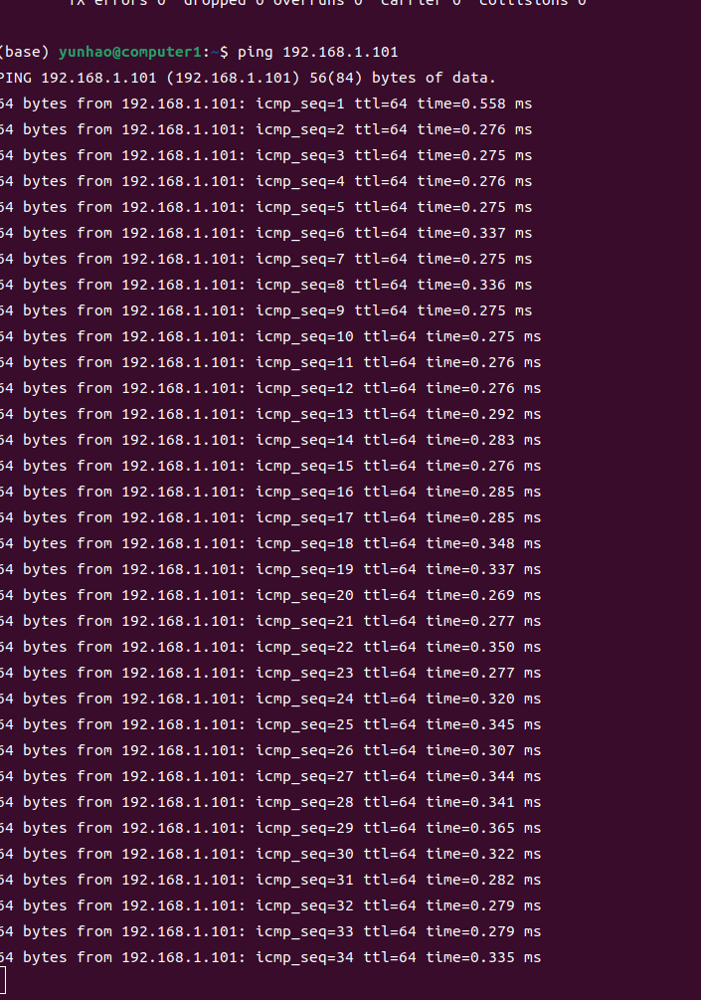
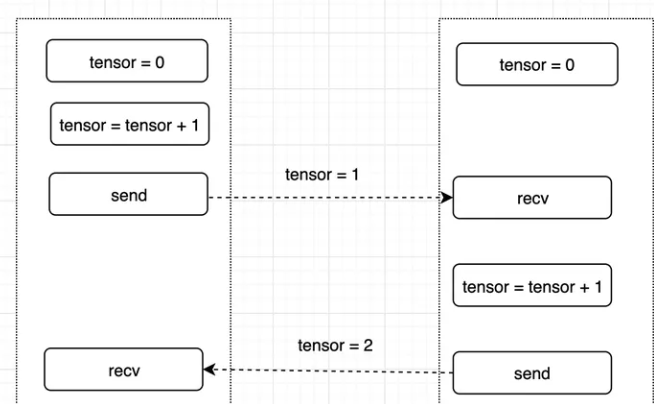
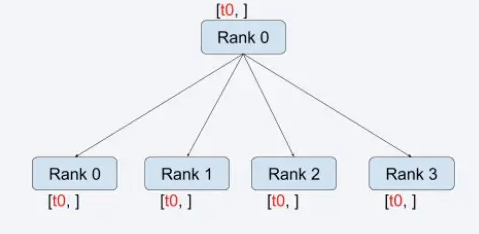
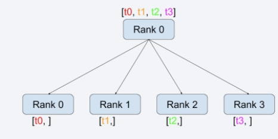
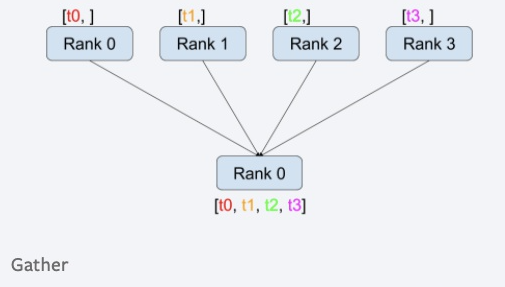
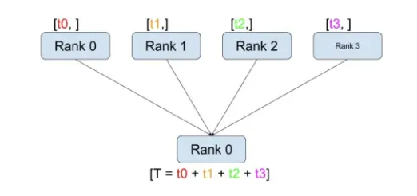
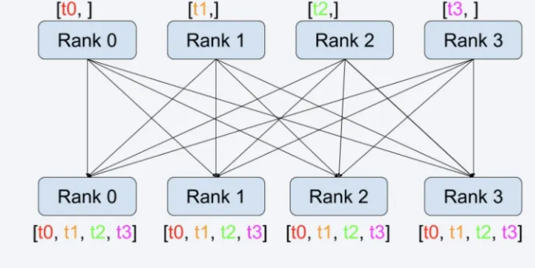
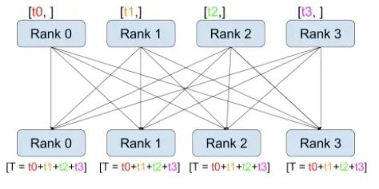
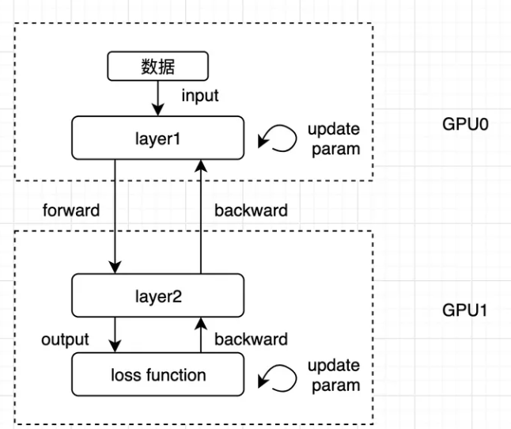

+ 准备两根网线和一台一进四出有线路由器。将两台电脑连接到路由器上。  
+ 设置主机名: sudo hostnamectl set-hostname computer1.设置完主机名后重新启动(sudo reboot)。   
+ 设置静态ip地址。通过修改yaml配置文件来将主机的计算ip固定。设置完后进行测试，发现可以ping通。  

  


## 一、单机多卡分布式训练  
pytorch中的分布式通信模块为torch.distributed  
### 1.单机多卡分布式训练实例
+ 通过环境变量MASTER_ADDR 和MASTER_PORT设置rank0的IP和PORT信息，rank0是协调节点，需要其他所有节点了解rank0的ip地址。  
+ 后端选择的是nccl，通过设置NCCL_DEBUG环境变量为INFO，输出NCCL的调试信息。   
+ init_process_group:执行网络通信模块的初始化工作。  
  + backend:设定后端网络通信的实现库，可选的为gloo、nccl、mpi；  
  + rank：为当前rank的index，用于标记当前是第几个rank，取值为0到work_size - 1之间的值；  
  + world_size: 有多少个进程参与到分布式训练中。  

```
# set env信息
os.environ['MASTER_ADDR'] = '127.0.0.1'
os.environ['MASTER_PORT'] = '29500'
os.environ['NCCL_DEBUG'] = "INFO"

# create default process group
dist.init_process_group(backend="nccl", rank=rank, world_size=world_size)
```  
 
通过下面的代码创建本地模型和分布式模型：  
+ nn.Linear(10, 10).to(rank): 创建线性变换模型，input size和out put size都是10，并且将模型copy到gpu上（通过rank来标识gpu 的id。  
+ DDP(model, device_ids=[rank]): 创建分布式模型；该模型会将local model 复制到所有副本上，并对数据进行切分，然后使得每个local model都按照mini batch进行训练。  

```
# create local model
model = nn.Linear(10, 10).to(rank)

# construct DDP model
ddp_model = DDP(model, device_ids=[rank])
```  
  
通过ddp_model执行forward和backward计算，这样才能够达到分布式计算的效果：  
```
# define loss function and optimizer
loss_fn = nn.MSELoss()
optimizer = optim.SGD(ddp_model.parameters(), lr=0.001)
# forward pass
outputs = ddp_model(torch.randn(20, 10).to(rank))
labels = torch.randn(20, 10).to(rank)

# backward pass
loss_fn(outputs, labels).backward()

# update parameters
optimizer.step()
```  
启动一个有两个process组成的分布式任务：  
+ run_worker：子进程执行的function，会以fn(i, *args)的形式被调用，i为process的id（0，1，2...），*args为spawn的args参数
+ args：执行进程的参数
+ nprocs：进程的个数
+ join：是否等待子进程执行完成
```
def main():
    worker_size = 2
    mp.spawn(run_worker,
        args=(worker_size,),
        nprocs=worker_size,
        join=True)
```  
### 2.分布式通信原理  
分布式训练可以分为数据并行、模型并行，流水线并行和混合并行。分布式算法又有典型的parameter server和ring all-reduce。无论是哪一种分布式技术一个核心的关键就是如何进行communication，这是实现分布式训练的基础，因此要想掌握分布式训练或当前流行的大模型训练务必对worker间的通信方式有所了解。  

Pytorch的分布式训练的通信是依赖torch.distributed模块来实现的，torch.distributed提供了point-2-point communication 和collective communication两种通信方式。  

#### P2P通信  
举例一个进程间通信任务：  
+ tensor 初始值为0
+ process 0 （或叫rank 0)：对tensor加1，然后发送给process 1(或叫rank1）；
+ process 1：接收到tensor后，对tensor 加2，然后在发送给process 0;
+ process 0：接收process1发送的tensor；  

  

##### 初始化：  
pytorch中在分布式通信原语使用之前，需要对分布式模块进行初始化。pytorch的分布式模块通过torch.distributed.init_process_group来完成。  
+ 通过环境变量MASTER_ADDR和MASTER_PORT设置rank0的IP和PORT信息，rank0的作用相当于是协调节点，需要其他所有节点知道其访问地址;  
+ 本例中后端选择的是gloo，通过设置NCCL_DEBUG环境变量为INFO，输出gloo的调试信息；  
+ init_process_group:执行网络通信模块的初始化工作。  
+ backend：设置后端网络通信的实现库，可选的为gloo、nccl和mpi；本例选择gloo作为backend(注：nccl不支持p2p通信，mpi需要重新编译pytorch源码才能使用）；
+ rank：为当前rank的index，用于标记当前是第几个rank，取值为0到work_size - 1之间的值；
+ world_size: 有多少个进程参与到分布式训练中;  

```
os.environ['MASTER_ADDR'] = "192.168.1.100"
os.environ['MASTER_PORT'] = "12355"
os.environ['NCCL_DEBUG'] = "INFO"
```

```
def init_process(rank_id, size, fn, backend='gloo'):
    """ Initialize the distributed environment. """
    dist.init_process_group(backend, rank=rank_id, world_size=size)
    fn(rank_id, size)
```  

##### 通信逻辑  
+ 通过rank_id来区分当前应该执行哪一个rank的业务逻辑。  
+ pytorch 中通过torch.distributed.send(tensor, dst, group=None, tag=0) 和torch.distributed.isend(tensor, dst, group=None, tag=0) 来实现tensor的发送，其中send是同步函数，isend是异步函数；
    + tensor：要发送的数据
    + dst：目标rank，填写目标rank id即可。  
+ pytorch中通过torch.distributed.recv(tensor, src=None, group=None, tag=0)和torch.distributed.irecv(tensor, src=None, group=None, tag=0)来实现tensor的接收，其中recv是同步函数，irecv是异步函数；
    + tensor：接收的数据
    + src：接收数据来源的rank id  

```
def run(rank_id, size):
    tensor = torch.zeros(1)
    if rank_id == 0:
        tensor += 1
        # Send the tensor to process 1
        dist.send(tensor=tensor, dst=1)
        print('after send, Rank ', rank_id, ' has data ', tensor[0])
        
        dist.recv(tensor=tensor, src=1)
        print('after recv, Rank ', rank_id, ' has data ', tensor[0])
    else:
        # Receive tensor from process 0
        dist.recv(tensor=tensor, src=0)
        print('after recv, Rank ', rank_id, ' has data ', tensor[0])
        
        tensor += 1
        dist.send(tensor=tensor, dst=0)
        print('after send, Rank ', rank_id, ' has data ', tensor[0])
```  

##### 启动测试  
+ 这里使用torch.multiprocessing来启动多进程，torch.multiprocessing是python库中multiprocessing的封装，并且兼容了所有的接口
+ multiprocessing.set_start_method : 用于指定创建child process的方式，可选的值为fork、spawn和forkserver。使用spawn，child process仅会继承parent process的必要resource，file descriptor和handle均不会继承。
+ multiprocessing.Process(group=None, target=None, name=None, args=(), kwargs={}, *, daemon=None) ： 用来启动child process  

```
import os
import torch
import torch.distributed as dist
import torch.multiprocessing as mp

def run(rank_id, size):
    tensor = torch.zeros(1)
    if rank_id == 0:
        tensor += 1
        # Send the tensor to process 1
        dist.send(tensor=tensor, dst=1)
        print('after send, Rank ', rank_id, ' has data ', tensor[0])
        dist.recv(tensor=tensor, src=1)
        print('after recv, Rank ', rank_id, ' has data ', tensor[0])
    else:
        # Receive tensor from process 0
        dist.recv(tensor=tensor, src=0)
        print('after recv, Rank ', rank_id, ' has data ', tensor[0])
        tensor += 1
        dist.send(tensor=tensor, dst=0)
        print('after send, Rank ', rank_id, ' has data ', tensor[0])


def init_process(rank_id, size, fn, backend='gloo'):
    """ Initialize the distributed environment. """
    os.environ['MASTER_ADDR'] = '127.0.0.1'
    os.environ['MASTER_PORT'] = '29500'
    dist.init_process_group(backend, rank=rank_id, world_size=size)
    fn(rank_id, size)
```  

#### Collective Communication  
##### 广播(Broadcast)  
  
在pytorch中通过torch.distributed.broadcast(tensor, src, group=None, async_op=False) 来broadcast通信。

+ 参数tensor在src rank是input tensor，在其他rank是output tensor；
+ 参数src设置哪个rank进行broadcast，默认为rank 0；  

##### 散射(scatter) 
  
在pytorch中通过torch.distributed.scatter(tensor, scatter_list=None, src=0, group=None, async_op=False) 来实现scatter通信。

+ 参数tensor为除 src rank外，其他rank获取output tensor的参数
+ scatter_list为进行scatter计算tensor list
+ 参数src设置哪个rank进行scatter，默认为rank 0；  

##### 收集(gather)  
  
gather计算方式如上图所示。在pytorch中通过torch.distributed.gather(tensor, gather_list=None, dst=0, group=None, async_op=False) 来实现gather的通信；

+ 参数tensor是所有rank的input tensor
+ gather_list是dst rank的output 结果
+ dst为目标dst  

##### 合并(reduce)  
  
reduce的计算方式如上图所示。在pytorch中通过torch.distributed.reduce(tensor, dst, op=<ReduceOp.SUM: 0>, group=None, async_op=False)来实现reduce通信；

+ 参数tensor是需要进行reduce计算的数据，对于dst rank来说，tensor为最终reduce的结果
+ 参数dst设置目标rank的ID
+ 参数op为reduce的计算方式，pytorch中支持的计算方式有SUM, PRODUCT, MIN, MAX, BAND, BOR, and BXOR  

##### all-gather  
  
all-gather计算方式如上图所示。在pytorch中通过torch.distributed.all_gather(tensor_list, tensor, group=None, async_op=False)来实现。

+ 参数tensor_list，rank从该参数中获取all-gather的结果
+ 参数tensor，每个rank参与all-gather计算输入数据  

##### all-reduce   
  
all-reduce计算方式如上图所示。在pytorch中通过torch.distributed.all_reduce(tensor, op=<ReduceOp.SUM: 0>, group=None, async_op=False) 来实现all-reduce的调用。  

### 3.数据并行分布式训练  
手动数据并行的分布式训练，整体流程如下：

+ 数据处理：将数据按照rank进行分片，每个rank读取对应的partition；
+ 模型训练：模型构建、forward、loss和backward均与单机相同，不同的是在进行梯度更新之前调用我们自定义的average_gradients 函数进行所有rank间的梯度同步，同步完成之后再调用optimize的step接口进行梯度的更新；
+ 调试执行：启动一个单机2 rank的DDP训练任务；

### 4.算子并行  
当一个神经网络过大无法存储到一个GPU设备上时，会使用算子间并行的策略来进行解决，将神经网络的多个layer放到不同的设备上进行训练。
例如一个神经网络仅有两个layer，每个layer占用8G显存（共16G），但是GPU设备仅有10G的容量，无法加载整个模型，此时可以采用算子间并行的策略，将两个layer分别放到两个GPU上进行计算；算子间模型并行的计算方式如下描述：  
+ 前向传播:
  + GPU0: layer1在GPU0上读取数据，进行前向计算，然后将output tensor 从gpu0 传输到GPU1上；
  + GPU1: layer2接收到数据后进行前项计算，并将output tensor传递给loss function进行loss计算；
+ 后向传播：
  + GPU1: 从loss function上触发backward计算，并将loss的grad传递给layer2；layer2计算完backward后，将grad传递给layer1
  + GPU0：layer1在GPU0上根据layer2的grad进行后向传播计算；
+ 梯度更新
  + layer1和layer2根据本层的parameter和grad在本地的GPU设备上进行参数的更新。  

  

模型并行需要在模型构建阶段将模型的不同的layer放到不同的gpu上，pytorch中通过Tensor.to(*args, **kwargs) 将layer放到指定的设备上;

+ 首先，ModelParallelResNet50继承自TORCHVISION.MODELS.RESNET；
+ 然后，将Resnet的layer按序分为了两个部分，分别放到gpu0和gpu1上；
+ 最后，在forward计算时，需要先将seq1的结果copy到gpu1上，然后再将结果出传递给seq2进行计算  

```
class ModelParallelResNet50(ResNet):
    def __init__(self, *args, **kwargs):
        super(ModelParallelResNet50, self).__init__(
            Bottleneck, [3, 4, 6, 3], num_classes=num_classes, *args, **kwargs)

        self.seq1 = nn.Sequential(
            self.conv1,
            self.bn1,
            self.relu,
            self.maxpool,
            self.layer1,
            self.layer2
        ).to('cuda:0')

        self.seq2 = nn.Sequential(
            self.layer3,
            self.layer4,
            self.avgpool,
        ).to('cuda:1')

        self.fc.to('cuda:1')
    
    def forward(self, x):
        x = self.seq2(self.seq1(x).to('cuda:1'))
        return self.fc(x.view(x.size(0), -1))   
```  

使用torch.profiler对GPU的运行情况进行跟踪；


训练逻辑整体代码如下:

将模型训练的流程放到profiler context manager来完成
在每次epoch的尾部，要记得调用profiler的step function  

```
def train(model):
    num_classes = 1000
    num_batches = 5
    batch_size = 120
    image_w = 128
    image_h = 128

    model.train(True)
    loss_fn = nn.MSELoss()
    optimizer = optim.SGD(model.parameters(), lr=0.001)

    one_hot_indices = torch.LongTensor(batch_size) \
                           .random_(0, num_classes) \
                           .view(batch_size, 1)

    with torch.profiler.profile(
            activities=[
                torch.profiler.ProfilerActivity.CPU,
                torch.profiler.ProfilerActivity.CUDA],
            schedule=torch.profiler.schedule(
                wait=1,
                warmup=1,
                active=2),
            on_trace_ready=torch.profiler.tensorboard_trace_handler('./result'),
            record_shapes=True,
            profile_memory=True,  # This will take 1 to 2 minutes. Setting it to False could greatly speedup.
            with_stack=True
    ) as p:       
        for i in range(num_batches):
            # generate random inputs and labels
            inputs = torch.randn(batch_size, 3, image_w, image_h)
            labels = torch.zeros(batch_size, num_classes) \
                          .scatter_(1, one_hot_indices, 1)

            # run forward pass
            optimizer.zero_grad()
            outputs = model(inputs.to('cuda:0'))

            # run backward pass
            labels = labels.to(outputs.device)
            loss = loss_fn(outputs, labels)
            loss.backward()
            print("epoch: " + str(i) + ", loss: " + str(loss.item()))
            optimizer.step()
            p.step()  # 不要忘记对profile manager进行迭代
```  

### 5.多机多卡分布式训练  
训练任务分为4个流程:  
+ 模型构建：同单机单卡训练一致，这里构建一个简单的全连接模型；
+ 训练流程：同单机多卡训练一致；通过torch.nn.parallel.DistributedDataParallel 来构建分布式任务，关键点是要设置好local rank；
+ 任务启动：描述如何启动多机多卡的分布式任务；
+ 调试结果：通过trace信息来观察多机多卡分布式任务执行结果；  

构建一个简单的全连接模型神经网络模型：  
```
class ToyModel(nn.Module):
    def __init__(self):
        super(ToyModel, self).__init__()
        self.net1 = nn.Linear(10, 10)
        self.relu = nn.ReLU()
        self.net2 = nn.Linear(10, 5)

    def forward(self, x):
        return self.net2(self.relu(self.net1(x)))
```  

训练流程如下：

+ 2~4行：通过LOCAL_RANK和RANK环境变量能够获取当前process的local_rank和rank的value（注：这些环境变量是torchrun设置的，无需用户自己指定）
    + local_rank：process在当前node上的rank id
    + rank：process在全局所有node上的rank id
+ 6~7行：使用DistributedDataParallell来构建分布式模型；这里需要通过local_rank来指定当前process所使用的GPU Device ID
+ 9~10行：创建loss和optimizer对象
+ 12~15行：前向传播loss计算（注：为了简化流程，这里的input和labels都是通过randn来获取的随机值）
+ 17~18行：后向传播和梯度更新
```
def train():
    local_rank = int(os.environ["LOCAL_RANK"])
    rank = int(os.environ["RANK"])
    print(f"[{os.getpid()}] (rank = {rank}, local_rank = {local_rank}) training...")
    
    model = ToyModel().cuda(local_rank)
    ddp_model = DDP(model, [local_rank])

    loss_fn = nn.MSELoss()
    optimizer = optim.SGD(ddp_model.parameters(), lr=0.001)

    optimizer.zero_grad()
    outputs = ddp_model(torch.randn(20, 10).to(local_rank))
    labels = torch.randn(20, 5).to(local_rank)
    loss = loss_fn(outputs, labels)
    
    loss.backward()
    optimizer.step()
    
    print(f"[{os.getpid()}] (rank = {rank}, local_rank = {local_rank}) loss = {loss.item()}\n")    
```  

使用torchrun来启动多机多卡任务，无需使用spawn接口来启动多个进程（torchrun会负责将我们的python script启动为一个process），因此直接调用上文编写的train函数，并在前后分别添加DistributedDataParallel的初始化和效果函数即可。  
```
def run():
    env_dict = {
        key: os.environ[key]
        for key in ("MASTER_ADDR", "MASTER_PORT", "WORLD_SIZE", "LOCAL_WORLD_SIZE")
    }
    print(f"[{os.getpid()}] Initializing process group with: {env_dict}")
    dist.init_process_group(backend="nccl")
    train()
    dist.destroy_process_group()


if __name__ == "__main__":
    run()
```