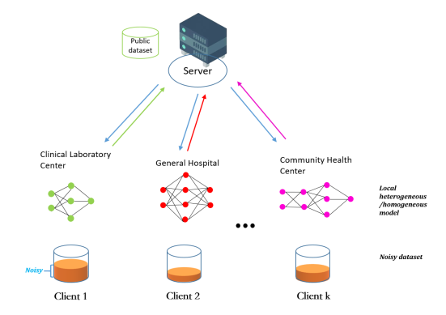
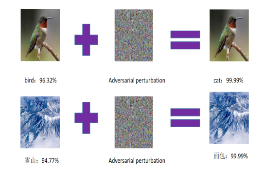
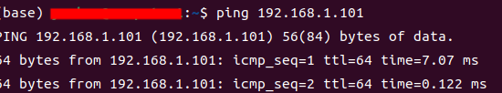
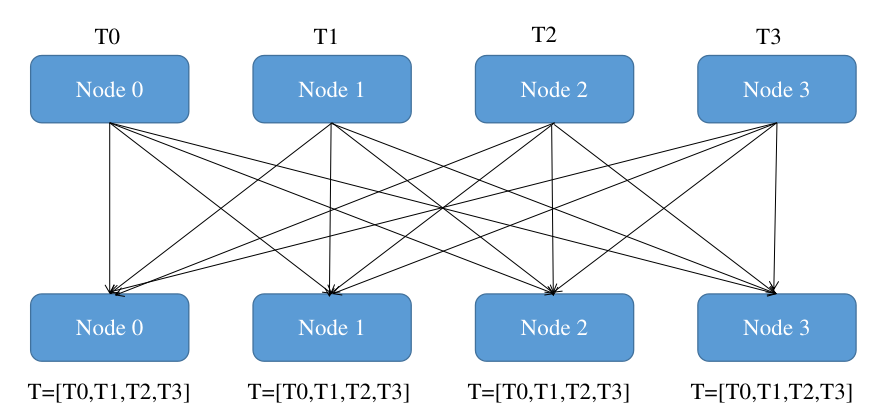
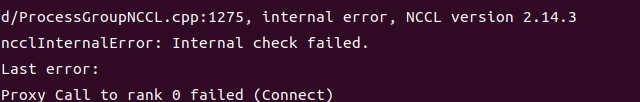
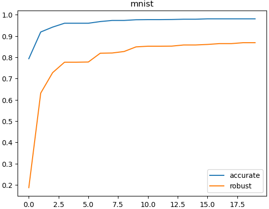

#! https://zhuanlan.zhihu.com/p/652537621
# 分布式联邦学习(对抗训练)实现  

联邦学习最开始是针对分布式机器学习关于隐私保护和协同训练的"Trade-off"问题所提出的一种解决范式，旨在保护用户隐私的同时进行多节点协同训练。但是实际上在学术应用中，人们往往通过单机来进行模拟。既不贴合原始业务场景，也会造成计算速度下降，费时费力。  

现行基于实际分布式物理计算节点的分布式联邦学习往往通过flower或者fate等框架来进行实现，但是出于对学习新框架的抵触和对Pytorch的熟悉，本文尝试仅仅基于Pytorch来搭建实际的物理分布式计算框架，同时为了增强联邦学习的鲁棒性，引入了对抗训练以增强模型的鲁棒性。  
  
### 任务描述
现有2个计算节点，每个计算节点有一张Nvidia TiTan显卡，每次的Batch有$2 \times batcsize$的数据，现在希望能够将模型复制到这两张卡，每张卡负责计算batchsize个数据的梯度，然后将这两张卡的梯度平均起来，接着再把梯度更新到所有模型上。

## 一、搭建准备  
### 工具:  
+ 有线交换机。  
+ 网线两根。  

+ 用网线将两台主机与交换机连接起来。  
+ 设置主机名: sudo hostnamectl set-hostname computer1.设置完主机名后重新启动(sudo reboot)。  
+ 设置静态ip地址。通过修改yaml配置文件来将主机的计算ip固定。设置完后进行测试，发现可以ping通。  
  

联邦学习所采用的中心聚合方式通常为Federated Average。一般而说，这样的中心聚合方式在分布式计算中，可以使用all-gather来加以实现，all-gather计算方式如下图所示。即将一个节点上的Tensor信息汇聚到每一个节点上，可以用来完成联邦学习所需要的Federated_average擦作。在pytorch中通过torch.distributed.all_gather(tensor_list, tensor, group=None, async_op=False)来实现。
  

## 二、编码过程  
##### 注意，下文所展示的代码大部分为示意图，完整代码请参见本文github连接。  
### 1.数据集
首先需要确定的是数据集，本文因为时间问题，所采用的数据集为Mnist,FMnist,Cifat10三个数据集。三个常用数据集可以直接从Torchvision中下载调用，本文的源代码打开了下载开关。  
###### [datasets.py](https://github.com/YunHao-Von/Federated-Adversarial-Learning/blob/main/FAT-Distributed/datasets.py)
```
train_dataset = datasets.MNIST(data_dir,train=True,transform=transforms.Compose([transforms.ToTensor()]),download=True)  # load the trainset for mnist
test_dataset = datasets.MNIST(data_dir,train=False,transform=transforms.Compose([transforms.ToTensor()]),download=True)  # load the testset for mnist
X_train, y_train = train_dataset.data, train_dataset.targets
X_test, y_test = test_dataset.data, test_dataset.targets
```  

### 2.定义模型  
因为本文引入了对抗训练，所以模型需要同时满足鲁棒性和准确性的要求。如果模型过于简单，因为容量问题，会造成模型在两个性能上都表现不佳，因此对于cifar数据集本文引入resnet为基础模型。
模型定义如下(Fminist和Mnist使用一个模型)：  
###### [models.py](https://github.com/YunHao-Von/Federated-Adversarial-Learning/blob/main/FAT-Distributed/models.py)
```
class ModelCifar(nn.Module):
    def __init__(self):
        super(ModelCifar, self).__init__()
        self.feature_extract = models.resnet152(pretrained=True)
        num_ftrs = self.feature_extract.fc.in_features
        self.feature_extract.fc = nn.Linear(num_ftrs, 10)

    def forward(self, x):
        x = self.feature_extract(x)
        return x
```  

### 3.编写主函数  
通过shell脚本运行所加入的环境变量通过os来进行解析。  
```
env_dict = {
        key: os.environ[key]
        for key in ("MASTER_ADDR", "MASTER_PORT", "WORLD_SIZE", "LOCAL_WORLD_SIZE")
    }
```  
其中，MASTER_ADDR是主机地址，MASTER_PORT为主机端口，WORLD_SIZE代表着计算节点总数，LOCAL_WORLD_SIZE为当前计算节点的显卡数量。  
获取测试集和模型后准备展开多进程训练，每个进程管理每个计算节点上的一张显卡，训练集在子进程中获取。  
通过init_process_group函数来进行pytorch的分布式初始化，后端通信框架选择'nccl'，如果使用cpu清修改为'gloo',timeout可以自行设置。  
destory_process_group函数用来销毁进程，确保不会占用过多空间。  

### 4.编写子进程内容  
首先，每个子进程可以通过环境变量读取其所属的rank（计算节点）和local_rank（当前计算节点的当前GPU），每一个子进程都唯一对应了一个GPU。  
通过process_data函数读取训练集数据，注意，在分布式机器学习中，每个机器上都有完整的数据集，但是每个机器所进行抽样的ID是不同的，process_data函数封装了抽样方案。  
因为参考[CalFAT(NIPS2022)](https://github.com/cc233/CalFAT)的设定，我们提供了独立同分布和非独立同分布(基于狄利克雷函数)的数据抽样方案，确保每个客户端抽样到属于其自己的数据集。  
```
if partition == 'iid':  # 如果数据呈现独立同分布
        idxs = np.random.permutation(data_size)  # Generate a permutation for the list[0,...,data_size - 1]
        batch_idxs = np.array_split(idxs, n_parties)  # Split the permutation into n_parties 
        net_dataidx_map = {i: batch_idxs[i] for i in range(n_parties)}  # Generate a dict for the generated lists.{i:[]}
    
    elif partition == "dirichlet":
        min_size = 0
        min_require_size = 10
        label = np.unique(y_test).shape[0]
        net_dataidx_map = {}
```
抽样完成后，使用dataloader载入数据，开始各个客户端的训练。
在使用模型之前，需要通过DistributedDataParallel将模型分发到每一个显卡之上。  
```
ddp_model = DDP(model,[local_rank])
```

参考PGD原始论文，执行对抗训练只需要对抗样本，不需要原始样本来进行梯度下降，因此我们首先生成对抗样本。
其中，sets代表了对于不同数据集，我们生成对抗样本的步长和范数球大小。  
```
def kl_adv(model,x_natural,dataset,marloss,local_rank):
    """Use the kl loss to generated the adversarial exmpales."""
    sets = {"mnist": dict(step_size=0.01, epsilon=0.3),
        "fmnist": dict(step_size=0.01, epsilon=0.3),
        "cifar10": dict(step_size=2.0 / 255, epsilon=8.0 / 255),
        }
    cfgs = sets[dataset]
    epsilon, step_size = cfgs['epsilon'],cfgs['step_size']
    num_steps = 40 if dataset == "mnist" else 10
    criterion_kl = nn.KLDivLoss(size_average=False)  
    model.eval()
    x_adv = x_natural.detach() + 0.001 * torch.randn(x_natural.shape).cuda(local_rank).detach()
    for __ in range(num_steps):
        x_adv.requires_grad_()
        with torch.enable_grad():
            loss_kl = criterion_kl(
                F.log_softmax(marloss(model(x_adv)),dim=1),
                F.softmax(marloss(model(x_natural)),dim=1)
            )
        grad = torch.autograd.grad(loss_kl,[x_adv])[0]
        x_adv = x_adv.detach() + step_size * torch.sign(grad.detach())
        x_adv = torch.min(torch.max(x_adv, x_natural - epsilon), x_natural + epsilon)
        x_adv = torch.clamp(x_adv, 0.0, 1.0)
    x_adv = Variable(torch.clamp(x_adv, 0.0, 1.0), requires_grad=False)
    return x_adv
```
设定好local_epoch，来进行对抗样本的迭代，在客户端迭代完成后返回模型，设定all_gather来进行模型参数的汇聚，以进行模型参数的平均。  
注意，all_gather函数只支持填入tensor，并不支持直接返回模型保存的dict。所以在此处，我们将模型参数信息先转化为了Tensor，还要进行展开才好进行合并操作:  
```
local_model = FATTrain(dataset_name,model)
local_params = [param.data.flatten() for param in local_model.parameters()]
requires_grad_list = [param.requires_grad for param in local_model.parameters()]
flatten_params = torch.cat(local_params)
gathered_params = [torch.zeros_like(flatten_params) for _ in range(int(world_size))]
dist.all_gather(gathered_params,flatten_params)
```
然后再进行平均，因为平均后的模型参数不会再携带require_grad信息，所以需要本进程里的模型信息进行复原d，此处我们专门设计了一个模型复原函数:  
```
gathered_params = torch.stack(gathered_params)
mean_gathered_params = torch.mean(gathered_params, dim=0)
global_model = model_reload(local_model,mean_gathered_params,requires_grad_list)
```  
然后将这一轮平均好的模型进行测试，看看其模型效果:  
```
natural_err_total, robust_err_total = eval_adv_test_whitebox(global_model, test_loader, dataset_name)
```
最后，进行反复迭代后，本文对模型的评估原则出于两个方面，即准确率和鲁棒性，保存准确率和鲁棒性最好的模型信息。  

## 三、程序启动  
使用torchrun来启动多机多卡任务，无需使用spawn接口来启动多个进程（torchrun会负责将python脚本启动为一个process），因此直接调用上文编写的main.py脚本并添加环境变量即可:  
机器1启动:
```
torchrun --nproc_per_node=1 --nnode=2 --node_rank=0 --master_addr="192.168.1.100" --master_port=29555 all-reduce_multi-node.py
```  
机器2启动:
```
torchrun --nproc_per_node=1 --nnode=2 --node_rank=2 --master_addr="192.168.1.100" --master_port=29555 all-reduce_multi-node.py
```  
本文将这两行命令封装为.sh文件，直接sh调用即可。  

如果调用命令的时候出现代理错误，即:  
  
请在启动该终端的时候设定好export NCCL_SOCKET_IFNAME=enp5s0(你的网卡接口)即可。   
Mnist的结果大概如图所示:  

实际测算速度应该提升1.7倍左右。  
